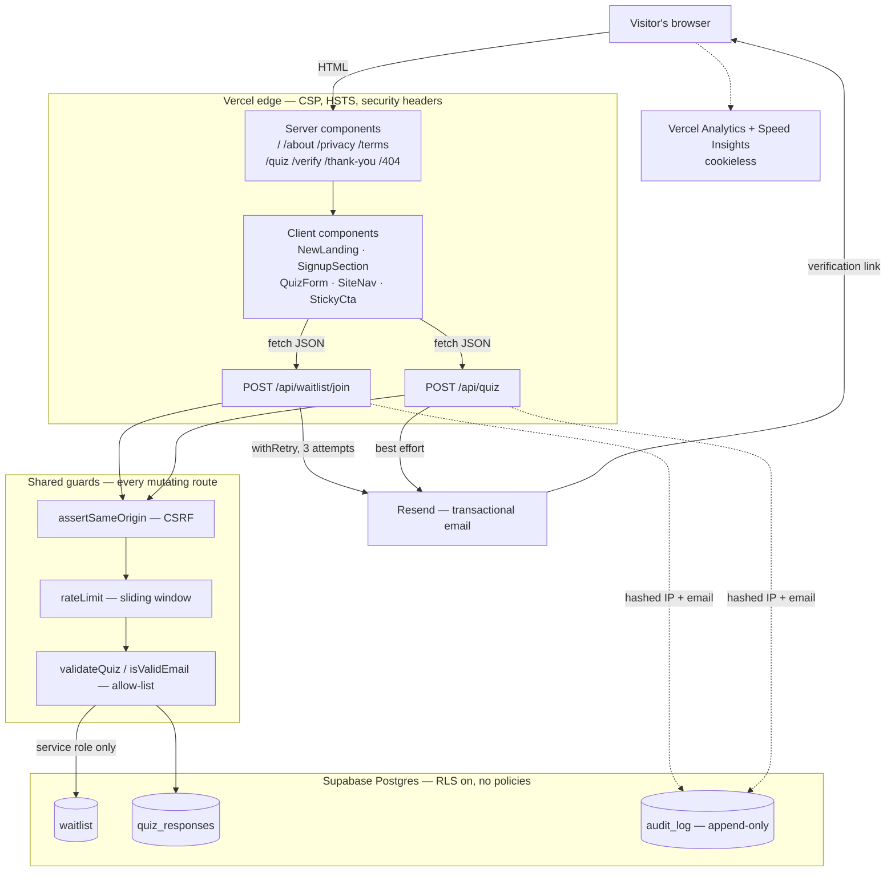

# Lumin — Architecture

Pre-launch marketing site with a free waitlist and a skin quiz. No payment,
no login, no user-generated content rendered to other users.

## System diagram



## Signup flow

```mermaid
sequenceDiagram
    actor U as Visitor
    participant S as Site
    participant DB as Supabase
    participant M as Resend

    U->>S: email + explicit consent
    S->>S: same-origin, rate limit, validate
    S->>S: token = random(32B); store SHA-256(token) only
    S->>DB: upsert waitlist row (pending)
    S->>M: verification link containing raw token
    M-->>U: "Confirm & start the quiz"
    U->>S: GET /verify?token=…
    S-->>U: redirect to /quiz
    U->>S: POST /api/quiz with token + 13 answers
    S->>DB: lookup row WHERE hash = SHA-256(token)
    Note over S,DB: possession of the token IS the authorization
    S->>DB: insert quiz_responses; mark verified
    S->>M: "You're in — #position"
    S-->>U: position confirmation
```

## Trust boundaries

| Boundary | What crosses it | Control |
| --- | --- | --- |
| Browser → route handler | email, consent, quiz answers, token | same-origin check, rate limit, body-size cap, allow-list validation |
| Route handler → Postgres | validated values only | service-role key, `server-only`, RLS default-deny |
| Route handler → Resend | recipient + rendered HTML | API key server-side only; user name HTML-escaped |
| Browser → analytics | page view, Web Vitals | cookieless, no cross-site identifier |

## What is deliberately absent

- **No auth system.** Nothing to log into. See ADR 0001.
- **No client-side database access.** See ADR 0002.
- **No payment path.** Removed with the $1 deposit; no card field exists.
- **No face-scan storage.** Scanning ships post-launch behind its own consent.

## Data retention

| Data | Kept |
| --- | --- |
| Verified waitlist + quiz answers | 24 months after last interaction |
| Unverified signups | deleted after 90 days |
| Verification tokens | expire after 7 days |
| Audit log | hashed identifiers only; no raw IP or email |

## Environment variables

| Name | Where | Required | Effect if missing |
| --- | --- | --- | --- |
| `NEXT_PUBLIC_SUPABASE_URL` | build + server | yes | build fails |
| `SUPABASE_SERVICE_ROLE_KEY` | server only | yes | signup returns 503 |
| `RESEND_API_KEY` | server only | yes | signup returns 202 "saved, not sent" |
| `NEXT_PUBLIC_SITE_URL` | build | recommended | canonical URLs fall back to a default |
| `EMAIL_FROM` | server | optional | falls back to the Resend sandbox sender |
| `IP_HASH_SALT` | server | recommended | uses a default salt; rotate before launch |
| `UPSTASH_REDIS_REST_URL` / `_TOKEN` | server | optional | rate limiting falls back to per-instance memory |

## Verification

`npm run verify` runs typecheck → lint → tests with coverage thresholds →
production build. Coverage gates at 70% across statements, branches, functions
and lines for `lib/**`; modules needing live Redis or Postgres are excluded and
covered by integration testing instead.
